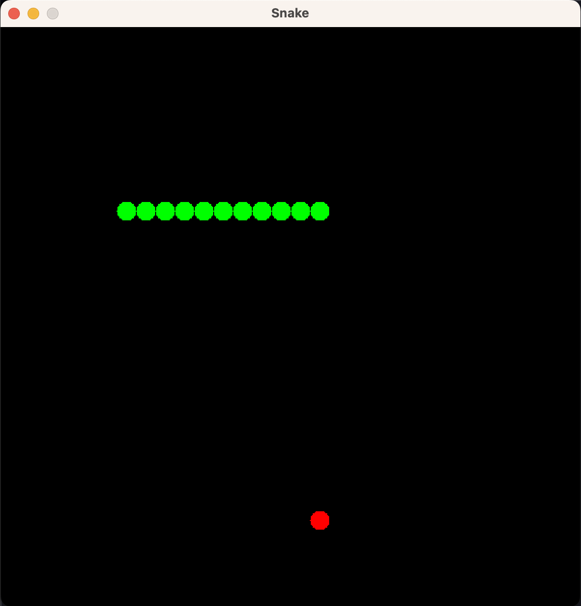
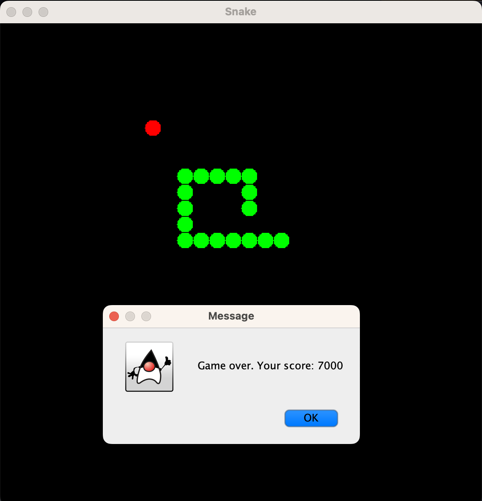

# Snake

Snake game written in Java. 

My first attempt at implementing an [Entity Component System][res:wikipedia:ecs] from scratch as part of learning more about game programming.

# Resources&nbsp;:mortar_board:

- [Game Programming Series: Entity Component System][res:youtube:thecherno:ecs] (YouTube)
- [Game Programming Patterns: Component][res:gameprogrammingpatterns:component] (Book)
- [Entity Component System][res:tsprojectsblog:ecs] (Blog)
- [Entity Systems Wiki][res:entitysystemswiki] (Wiki)
- [Understanding Entity Component System][res:gamedev:understanding-ecs] (Forum)

# Prerequisites&nbsp;:vertical_traffic_light:

- [Git][git:download]
- [Java][java:download]
- [Maven][maven:download]

# Getting started&nbsp;:runner:

### Getting the code&nbsp;:octocat:

- Clone the repository: `git clone https://github.com/taardal/snake`

### Running the app&nbsp;:rocket:

**Script**

- Make run-script executable: `chmod +x run.sh`
- Run the script: `sh run.sh`

**Manual**

- Build the app: `mvn clean package`
- Run the app: `java -jar target/snake-jar-with-dependencies.jar`

 

  
  

[git:download]: https://git-scm.com/downloads
[java:download]: http://www.oracle.com/technetwork/java/javase/downloads/jdk8-downloads-2133151.html
[maven:download]: https://maven.apache.org/download.cgi
[res:entitysystemswiki]: http://entity-systems.wikidot.com/
[res:gameprogrammingpatterns:component]: http://gameprogrammingpatterns.com/component.html
[res:gamedev:understanding-ecs]: https://www.gamedev.net/articles/programming/general-and-gameplay-programming/understanding-component-entity-systems-r3013/
[res:tsprojectsblog:ecs]: https://tsprojectsblog.wordpress.com/portfolio/entity-component-system/
[res:wikipedia:ecs]: https://en.wikipedia.org/wiki/Entity_component_system
[res:youtube:thecherno:ecs]: https://www.youtube.com/watch?v=Z-CILn2w9K0&ab_channel=TheCherno